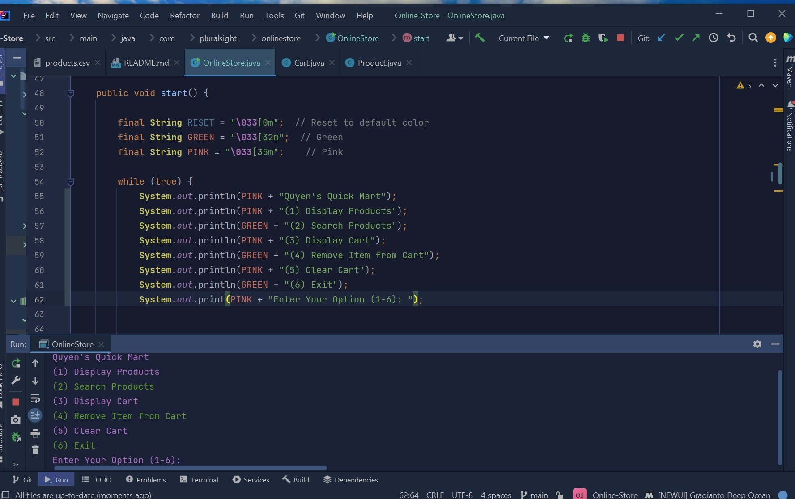

# Quyen's Quick Mart

It's like TJ Maxx meets Microcenter. My inventory consists of data items pulled from an Excel CSV file. In this application, the user is able to:

1. Display items currently in the Quick Mart (including SKU number, name, price, and the department)...

* This is done by creating an ArrayList, creating a filepath, and using the BufferedReader and FileReader to read from the input stream. I now have my store products/inventory loaded!

2. Searching for a specific product...

* This is where the .get method and the Getters & Setters come in handy. They help you search and filter through your ArrayList.

* ERROR! ERROR! ERROR!
Always have a "just in case" when you're writing code. You must prompt the user customer in case their search comes up empty. Or if your code only reads lowercase but the customer wrote in all caps.

3. Displaying the cart...

* No one remembers what they add to their cart. It's nice to let the customer see what they're missing or may want to remove. I do all my magic in the cart class and the product class.

4. Remove items from cart...

* We've all added 50+ items to our cart with absolutely zero intentions to buy every item. I used the remove() method to ensure that customers are able to remove items so that buyers remorse is lessened.

5. Clear cart...

* As software developers, we aim for efficiency. On the other end of my application, I also want to provide my customer the ability to wipe their cart if they pleased instead of remove each individual item. So, I decided to create a short and sweet clear() method and call it into my switch-case statement. You can consider it my "cool" little piece of efficiency.

6. Exit...

Closing time, one last call for....exiting the method.

